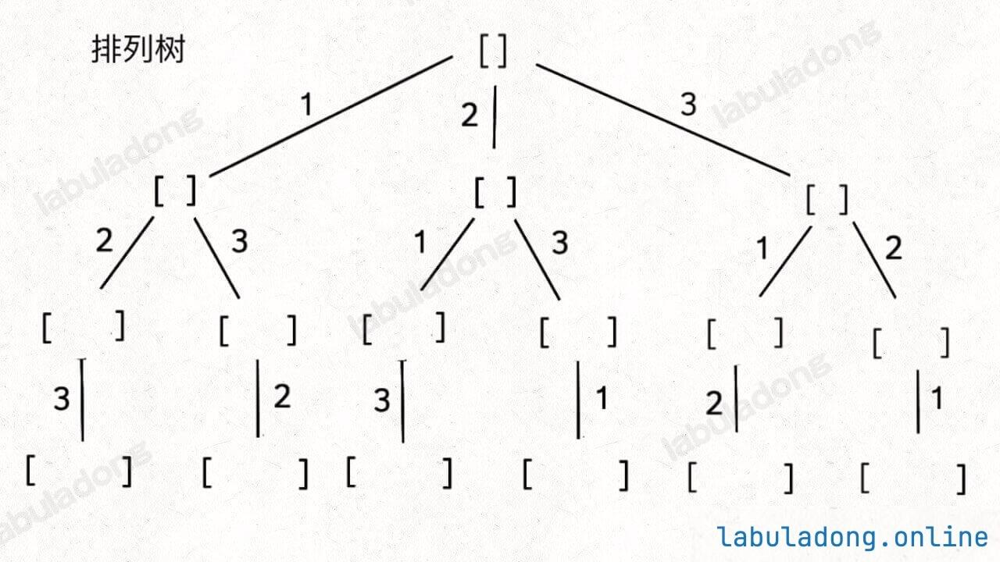
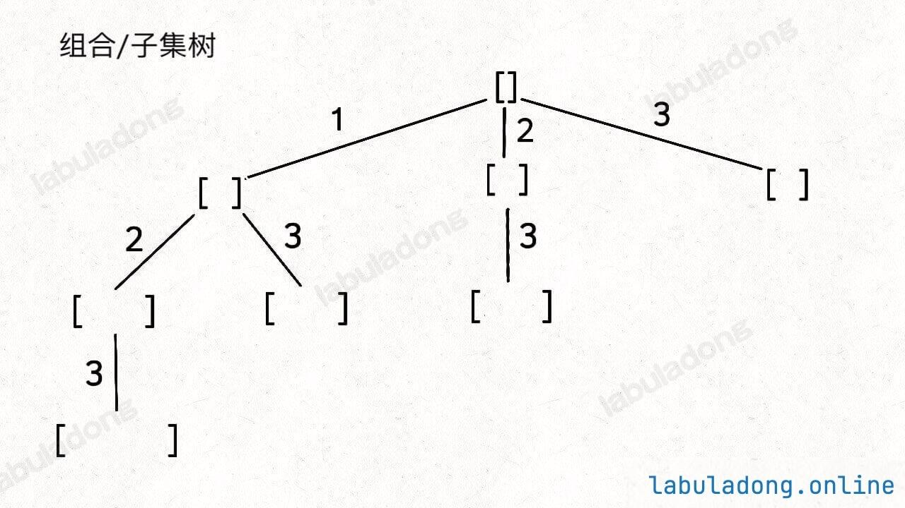

# 原则 

抽象地说，解决一个回溯问题，实际上就是遍历一棵决策树的过程，树的每个叶子节点存放着一个合法答案。你把整棵树遍历一遍，把叶子节点上的答案都收集起来，就能得到所有的合法答案。

站在回溯树的一个节点上，你只需要思考 3 个问题：

1. 路径：也就是已经做出的选择。
2. 选择列表：也就是你当前可以做的选择。
3. 结束条件：也就是到达决策树底层，无法再做选择的条件。

如何避免无限递归：
1. 如果不允许重复选择，在 for 循环作选择前 return 就可以保证。
2. 如果允许重复选择，需要设置好 base case，在 for 循环作选择前 return

## 变式

形式一、元素无重不可复选，即 nums 中的元素都是唯一的，每个元素最多只能被使用一次，这也是最基本的形式。
以组合为例，如果输入 nums = [2,3,6,7]，和为 7 的组合应该只有 [7]。

形式二、元素可重不可复选，即 nums 中的元素可以存在重复，每个元素最多只能被使用一次。
以组合为例，如果输入 nums = [2,5,2,1,2]，和为 7 的组合应该有两种 [2,2,2,1] 和 [5,2]。

形式三、元素无重可复选，即 nums 中的元素都是唯一的，每个元素可以被使用若干次。
以组合为例，如果输入 nums = [2,3,6,7]，和为 7 的组合应该有两种 [2,2,3] 和 [7]。

## 类型

有排列、组合、子集三种问题，结合以上变式共有 9 种变化。但无论形式怎么变化，其本质就是穷举所有解，而这些解呈现树形结构，所以合理使用回溯算法框架，稍改代码框架即可把这些问题一网打尽。树形结构的意思是每做一次选择相当于树往下走一层。



而组合问题和子集问题其实是等价的；至于三种变化形式，无非是在这两棵树上剪掉或者增加一些树枝罢了。

### 子集型/组合型

1. 通过保证元素之间的相对顺序不变
2. 每次决策时只能选择后面的选项，而不能往前选
来防止出现重复的子集。例如穷举 [1, 2, 3] 的子集，以列表顺序作为选择的顺序，这样就完成了剪枝。



组合就是挑选一部分符合条件的子集。

### 排列型

1. 通过保证相同元素在排列中的相对位置保持不变来防止出现重复的子集。

[附：原文讲解](https://github.com/labuladong/fucking-algorithm/blob/master/高频面试系列/子集排列组合.md)

# 模版

```python
result = []
def backtrack(路径, 选择列表):
    if 满足结束条件:
        result.add(路径)
        return
    
    for 选择 in 选择列表:
        # 做选择
        将该选择从选择列表移除
        路径.add(选择)
        backtrack(路径, 选择列表)
        # 撤销选择
        路径.remove(选择)
        将该选择再加入选择列表
```

## 形式一、元素无重不可复选，

即 nums 中的元素都是唯一的，每个元素最多只能被使用一次，backtrack 核心代码如下:

```java
// 组合/子集问题回溯算法框架
void backtrack(int[] nums, int start) {
    // 回溯算法标准框架
    for (int i = start; i < nums.length; i++) {
        // 做选择
        track.addLast(nums[i]);
        // 注意参数
        backtrack(nums, i + 1);
        // 撤销选择
        track.removeLast();
    }
}

// 排列问题回溯算法框架
void backtrack(int[] nums) {
    for (int i = 0; i < nums.length; i++) {
        // 剪枝逻辑
        if (used[i]) {
            continue;
        }
        // 做选择
        used[i] = true;
        track.addLast(nums[i]);

        backtrack(nums);
        // 撤销选择
        track.removeLast();
        used[i] = false;
    }
}
```

## 形式二、元素可重不可复选

即 nums 中的元素可以存在重复，每个元素最多只能被使用一次，其关键在于排序和剪枝，backtrack 核心代码如下：

Q: 子集/组合为什么只需要检查 `i > start && nums[i] == nums[i - 1]`就行？这样遇到重复就剪枝的话例如 90.Subsets II 为什么能遍历出 `[2, 2']` 这个子集？
A: 剪枝是对**同一层里的相同选择**进行剪枝，而 `[2, 2']` 是不同层的多次选择，每次都是在做第一个合法的选择，所以是可以的。

```java
Arrays.sort(nums);
// 组合/子集问题回溯算法框架
void backtrack(int[] nums, int start) {
    // 回溯算法标准框架
    for (int i = start; i < nums.length; i++) {
        // 剪枝逻辑，跳过值相同的相邻树枝
        if (i > start && nums[i] == nums[i - 1]) {
            continue;
        }
        // 做选择
        track.addLast(nums[i]);
        // 注意参数
        backtrack(nums, i + 1);
        // 撤销选择
        track.removeLast();
    }
}


Arrays.sort(nums);
// 排列问题回溯算法框架
void backtrack(int[] nums) {
    for (int i = 0; i < nums.length; i++) {
        // 剪枝逻辑
        if (used[i]) {
            continue;
        }
        // 剪枝逻辑，固定相同的元素在排列中的相对位置
        if (i > 0 && nums[i] == nums[i - 1] && !used[i - 1]) {
            continue;
        }
        // 做选择
        used[i] = true;
        track.addLast(nums[i]);

        backtrack(nums);
        // 撤销选择
        track.removeLast();
        used[i] = false;
    }
}
```

## 形式三、元素无重可复选

即 nums 中的元素都是唯一的，每个元素可以被使用若干次，只要删掉去重逻辑即可，backtrack 核心代码如下：

```java
// 组合/子集问题回溯算法框架
void backtrack(int[] nums, int start) {
    // 回溯算法标准框架
    for (int i = start; i < nums.length; i++) {
        // 做选择
        track.addLast(nums[i]);
        // 注意参数
        backtrack(nums, i);
        // 撤销选择
        track.removeLast();
    }
}

// 排列问题回溯算法框架
void backtrack(int[] nums) {
    for (int i = 0; i < nums.length; i++) {
        // 做选择
        track.addLast(nums[i]);
        backtrack(nums);
        // 撤销选择
        track.removeLast();
    }
}
```

# 总结

1. 排列和子集/组合的区别就是 backtack 的入参有无 start 控制选择列表
2. 可重和无重的区别就是需要排序后根据相同值进行剪枝
3. 可复选的区别就是选择列表允许包括当前选项